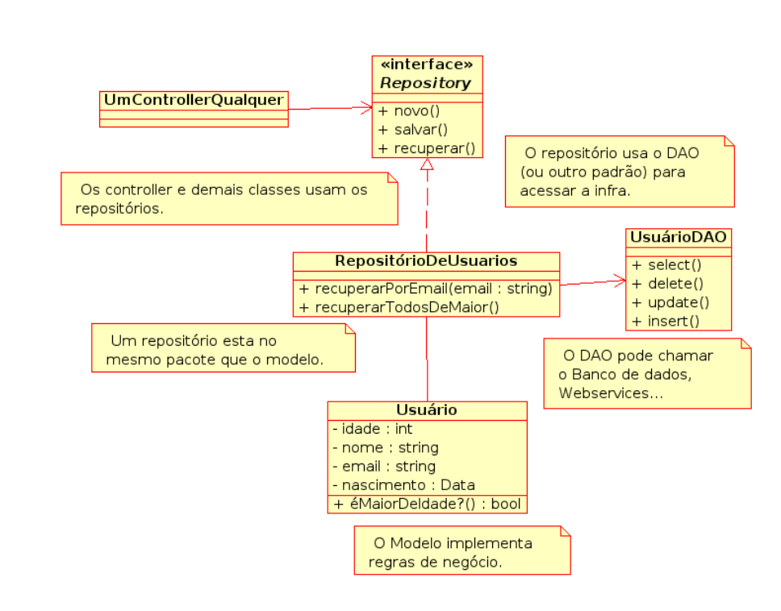
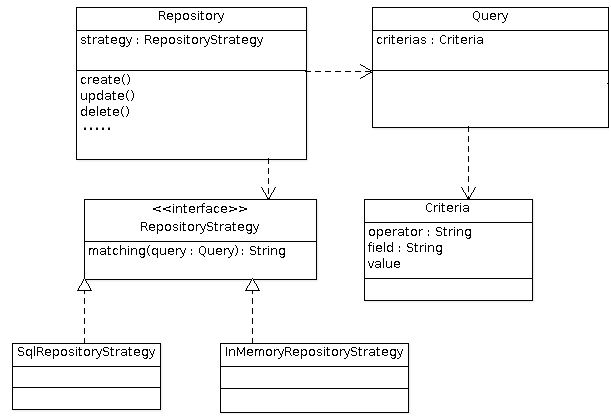

# Repository

<!-- Um *Repository* é um objeto que isola os objetos ou entidades do domínio do código que acessa o banco de dados.-->

**Repository (Repositório)** é um padrão de projeto que visa mediar a a formulação de pesquisa para os objetos de domínio/negócio/modelo e a camada de persistência, usando uma interface semelhante à de uma coleção.

Para a camada de domínio parece que estamos filtrando uma coleção em memória. Para a camada de persistência (mapeamento) estamos fornecendo uma frase de pesquisa que ela entende. No meio, libertamos a camada de domínio (negócio) de saber como fazer pesquisas na camada de persistência e ganhamos um local centralizado para modificar a tradução entre as duas camadas.
<!--Repositório é uma subcamada da camada de modelo/domínio/negócio que -->
Além disso, abstraímos o acesso à camada de persistência, ou seja, abstraímos mais ainda o acesso ao nosso banco de dados relacional ou, até mesmo, outra tecnologia usada para persistência. Para os objetos de modelo, fica a impressão de que os mesmos estão sendo salvos em coleções na memória, quando na verdade podem estar sendo salvos em um B.D relacional, arquivo XML, ou mesmo ficando em coleções na memória (caso se queira realizar testes sem a necessidade de persistir os objetos).

<!--
O padrão *Repository* segue o princípio da *Dependency Inversion Principe (DIP)* que prega que:

> Módulos de alto nível não devem depender de módulos de baixo nível. Ambos devem depender de abstrações.
> Abstrações não devem depender dos detalhes. Detalhes devem depender das abstrações

Em outras palavras: 
-->

**Se a camada de modelo acessasse diretamente a camada de persistência, os objetos do modelo estariam dependendo diretamente da infra-estrutura da aplicação**, além do mais, o modelo saberia que os objetos estão sendo armazenados em outro lugar - e essa informação não é importante para ele e, para deixar o modelo enxuto e independente, o importante seria que ele não soubesse disso. <!--Com o Repositório, os objetos de modelo lidam diretamente com o Repositório, lugar onde se adicionam e retiram objetos e que pertence ao próprio modelo.-->

Repositório também torna o desenvolvimento mais intuitivo, uma vez que se programa o modelo como se não existisse persistência. Todos os objetos do modelo são obtidos do repositório através de uma interface cujos métodos possuem a mesma sintaxe dos métodos de coleção como, por exemplo, *add()*, *remove* e *contains()*.

Esse padrão se torna mais importante e viável quando há um grande número de classes do modelo e consultas pesadas, ajudando a minimizar as duplicadas das lógicas das consultas. Não é necessário ter um Repositório por classe de negócio, apesar de ser uma boa prática.

## O problema

É comum em um sistema de complexidade média ou grande utilizar algum mecanismo de mapeamento de dados. **Este mecanismo visa minimizar a impedância que existe entre o modelo de dados traduzido em um conjunto de objetos e o mesmo modelo de dados traduzido em um forma inerente ao mecanismo de persistência usado na aplicação (normalmente, um banco de dados)**. Uma das operações mais comuns neste cenário é necessitar consultar os dados com base em algum critério. Essa pesquisa é normalmente descrita em uma linguagem própria ao mecanismos de mapeamento. **Neste cenário é interessante isolar a criação de consultas, criando uma camada extra e deixando o resto da aplicação especificar as consultas de forma genérica e sem associação ao mecanismos de mapeamento.**

## A solução

**O padrão propõe que se utilize um objeto como intermediário entre a camada de domínio (negócio) e a camada de mapeamento de dados (persistência). Este objeto recebe especificações das pesquisas, na forma de objetos e as traduz para a camada de mapeamemnto na forma prescrita pello mecanismos de mapeamento. A vantagem é que o domínio especifica essas pesquisas como se os dados estivessem em memória em um coleção gigante isolando do domínio de saber extamenete onde estão dos daddos e como a pesquisa é processada.**

## Como funciona

O objeto **Repositório** tem uma interface simples. Ele recebe um objeto com a especificação da pesquisa e retorna uma coleção com os objetos de domínio que satisfazem essa pesquisa. 

> Qualquer objeto pode ser usado para especificar a pesquisa, mas o ideal é utilizar o padrão **Query Object** (do ponto de visto do padrão **Query Object** o **Repository** atua como um interpretador da especificação).

**Para ficar mais claro, imaginemos que o mapeamento é entre objetos Java e um Banco de Dados que suporta SQL:**

Enquanto o DAO apresenta métodos simplificados para inserir, apagar e atualizar dados ele ainda receberia instruções em SQL para retornar os registros no banco de dados. 
    
* O **Repository** tem então duas funções:

    * Traduzir a especificação de pesquisa enviada pela camada de domínio para um frase SQL e passar essa frase ao DAO

    * Converter os dados retornados pela pesquisa em objetos de domínio 

Estes objetivos parecem simples o suficiente para serem deixados a cargo da camada de aplicação mas sua complexidade pode aumentar rapidamente conforme o modelo de domínio evolui. Por outro lado, quando o mecanismo de mapeamento não for um banco de dados, a linguagem SQL, será inútil. Quando existir a necessidade de comunicar com uma camada de mapeamento (persistência) diferente que usa uma linguagem diferente teríamos que construir um outro repositório para responder às mesmas especificações de pesquisa do domínio (negócio). É aqui que o padrão **Strategy** brilha mantendo um único objeto com quem o domínio tem que conversar mas ampliando os tipos de camadas de mapeamento com que o repositório pode se entender.

## Um pouco mais de Repository

Os *Repositórios* pertencem ao modelo da aplicação, são parte da camada de negócio complementando o *Model* e fornecendo estes objetos as outras camadas (como *Controle* e *Apresentação*, se aplicável) e recuperando estes do banco de dados.

**Porém, sendo parte do modelo, os repositórios não conhecem detalhes de infra-estrutura da aplicação (banco de dados, http, etc).**, e é na área de infra em que atuam os DAOs. Assim, o DAO tem o trabalho de traduzir as chamadas à persistência em chamadas de infra-estrutura, sejam elas banco de dados, webservices, arquivos em disco ou outra abordagem qualquer.

Um Repositório implementa parte das regras de negócio no que se refere à composição das entidades. Ele é fortemente vinculado ao dominío da aplicação e este é um reflexo direto das regras de negócio, pois ele abstrai armazenamento e consulta de um ou mais entidades de domínio.
Entretanto, não podemos confundir isso com as regras de negócio no sentido de processamento das informações. Um repositório não deve incluir as regras de negócio no sentido de tomar decisões, aplicar algoritmos de transformação dos dados ou prover serviços diretamente a outras camadas ou módulos da aplicação. Mapear entidades de domínio e prover as funcionalidades da aplicação são responsabilidades distintas.

Um repositório fica entre as regras de negócio e a camada de persistência:

1. Ele provê uma interface para as regras de negócio onde os objetos são acessados como em uma coleção

2. Ele usa a camada de persistência para gravar e recuperar os dados necessários para persistir e recuperar os objetos de negócio

Portanto um repositório pode, inclusive, fazer uso de um ou mais DAOs.

## Estrutura

Em um sistema onde temos um modelo *Usuario*, teríamos um *UsuarioRepository* atuando no modelo. Este repositório faria a interface de criar, recuperar e guardar os Usuários e, pode incluir métodos específicos, como filtros ou pré-preencher os usuários. Entretanto, o repositório não sabe da infra, então ele poderia ter de delegar a um DAO as chamadas. Desta forma, os DAOs apenas implementam as chamadas mais genéricas como *select*, *insert*, *update* e *delete*. Em um framework atual, que oferece essa interface de forma simples, o repositório pdoeria passar a chamada ao framework, se a configuração não passar pelo repositório. A figura abaixo apresenta o diagrama UML do exemplo apresentado.

Então, ao receber uma chamada, o *Repositório* valida isto de acordo com as regras de negócio que o cabe (já que a maior parte pode estar no próprio modelo), e pede à mada de infra esses dados. A camada de infra trata essa chamada no que cabe à infra (valida, encode, traduz campos, e etc) e acessa a persistência. Ela trata o retorno da persistência no vale a infa (array para objetos, encoding, joins....) e devolve ao repositório. O repositório então trata este retorno o que diz respeito ao negócio, criando objetos, cálculos e o que for aplicável.

**Em muitos projetos isso gera classes desnecessárias e o mal uso dos repositórios. Uma forma diferente de lidar com isso é que os repositórios são interfaces, implementadas pelos próprios DAOs (o contrário não é válido), pois do ponto de vista de modelagem o modelo continua acessando o Repositório.**

Caso o interesse fosse trabalhar com mais de uma fonte de dados (ex: relacional e somente na memória e etc), teríamos que acrescentar o padrão Strategy e criar estratégias para a construção das consultas para as diferentes fontes. Desta forma, teríamos algo parecido com a figura abaixo:

Obs: Neste exemplo, além do padrão Strategy existe o padrão Query Object (ou Criteria) responsável pela criação das consultas. O padrão Builder também poderia ser usado para a construção das consultas (principalmente no formato SQL).

<!-- E pode-se ainda criar um repositório quando for preciso antes de um DAO. 
Esta forma parece um pouco mais complexo, mas é até mais simples --> 

## Repository vs DAO 

**DAO** e **Repository** são dois padrões de projetos importantes, cujos propósitos tem uma pequena área de intersecção. Porém, como veremos abaixo, eles difere, tanto em seus objetos, quanto em sua origem e implementação.

**DAOs** lidam diretamente com a fonte de dados e abstraem as operações realizadas nela. **Repositórios** provêm uma interface para tratar o armazenamento e recuperação de entidades do domínio como uma coleção.

Um **Repositório** está vinculado **à regra de negócio da aplicação** e está associado ao agregado dos seus objetos de negócio e retorna objetos de domínio que representam esses dados. Já o **DAO** (*Data Access Object*) a princípio tem o seu escopo limitado na captura e persistência dos dados de um objeto que representa um registro da base de dados. <!--, consequentemente, ele transmite apenas o mundo físico relacional da base de dados e **não representa o mini-mundo real do negócio da sua aplicação.**-->

O padrão Repository tem o objetivo de dar apoio ao modelo de domínio fornecendo persistência. Ao contrário do DAO, que é um objeto de infra-estrutura da aplicação e faz parte da camada de persistência, o Repository faz parte do modelo de domínio que é parte da camada de negócios.

A confusão acontece porque na maioria dos projetos toda persistência e acesso a dados é feita através de um, e apenas um, banco de dados. E, mais ainda, os frameworks atuais abstraem e traduzem os objetos em relacionamentos de forma tão simples que o DAO simplesmente passa ao framework o que recebe e retorna o resultado.

### DAO

Um *Data Access Object* é um objeto que provê uma interface abstraindo um banco de ados ou algum outro mecanismo de persistência externo à aplicação.

Objetivos:

1. **Encapsulamento:** não expor detalhes da fonte de dados para o resto da aplicação.
2. **Princípio da responsabilidade única:** ser o único lugar que trabalha com SQL ou dialeto específico daquela fonte de dados
3. **Satisfazer necessidades específicas da fonte de dados:** mapear devidamente as estruturas de dados ou objetos da aplicação de acordo com os tipos e estruturas específicas da fonte de dados.

Geralmente, cada método de um DAO executa uma única operação de leitura ou escrita no banco de dados.

### Quando usar os padrões

O uso de DAOs é praticamente uma necessidade se você não usa frameworks ORMs, mesmo que você use outra nomeclatura, afinal você precisa de um lugar para colocar o código SQL.

Repositórios, por outro lado, são interessantes para aplicações um pouco maiores, onde o custo de adicionar mais uma camada de abstração é justificado pelo reuso em outros componentes, módulos e camadas.

<!--
Como já descrito acima, quando se trabalha com um framework ORM, faz sentido criar repositórios para abstrair o código específico do framework. 
-->

### Onde eles se parecem

A confusão começa porque DAO quanto Repository abstraem de alguma forma o acesso aos dados, embora, como vimos acima, eles tem níveis completamente diferentes de abstração.

Outro problema é que algumas das operações (métodos) de DAOs e Repositórios são comuns e, dependendo da implementação, não tem diferença alguma. Parte disso é pela implementação incorreta dos padrões. Outra parte é porque nem sempre é possível seguir o modelo em sua completude, por exemplo quando a abstração em forma de uma coleção penaliza o desempenho de tal forma que um repositório precisa implementar um método de mais baixo nível para tornar uma funcionalidade viável.

### Onde divergem

Um ponto importantíssimo para entender que a diferença não é apenas acidental é entender a origem dos padrões. 
<!--Enquanto DAO foi pensado principalmente para abstrair fontes de dados genéricas, o contexto em que Repository foi concebido -->

DAOs podem persistir e recuperar objetos ou, em sistemas mais simples, das próprias entidades do sistema. Repositórios sempre fazem referência a um entidade de domínio da aplicação, Claro que você pode estender o conceito para outras coisas, mas não deve ser a norma.

DAOs geralmente abstraem um query do banco de dados. Repositórios podem necessitar de várias queries para compor uma entidade.

DAOs não gerenciam transações. Repositórios podem gerenciar ou pelo menos exigir a execução dentro de uma transação.

DAOs acessam diretamente a fonte de dados. Repositórios geralmente usam algum outro mecanismo para persistir dados, tal como um framework ORM ou os próprios DAOs.

O Repository é uma camada de negócio da aplicação, responsável por manter e persistir os objetos de Modelo, enquanto isto não envolver a infra. Quando tratar de infra, esse trabalho é delegado ao DAO ou diretamente ao framework, caso este seja bem abstraído.

O problema é que as pessoas confundem esses dois conceitos porque realmente são bem parecidos. Na maioria dos casos você irá precisar dos dois, porque o modelo de domínio fará buscas por objetos em um Repository que por sua vez delegará para o DAO, que é quem entende como é a infra-estrutura de armazenamento de dados. Para ele também não importa se o Repositório é uma classe ou uma interface, o que importa é que os objetos do domain model deverão dempre lidar com busca e persistência de objetos usando a interface do Repository, que tem o compromisso de ser mais semântica do que a do DAO.

## Referências

* [https://sergiotaborda.wordpress.com/desenvolvimento-de-software/java/patterns/repository/](https://sergiotaborda.wordpress.com/desenvolvimento-de-software/java/patterns/repository/)

* [https://felipelucioquirino.wordpress.com/2012/07/17/padrao-de-projeto-repository/](https://felipelucioquirino.wordpress.com/2012/07/17/padrao-de-projeto-repository/)

* [https://pt.stackoverflow.com/questions/12927/qual-a-diferen%c3%a7a-entre-dao-e-repository](https://pt.stackoverflow.com/questions/12927/qual-a-diferen%c3%a7a-entre-dao-e-repository)

* [https://thinkinginobjects.com/2012/08/26/dont-use-dao-use-repository/](https://thinkinginobjects.com/2012/08/26/dont-use-dao-use-repository/)
